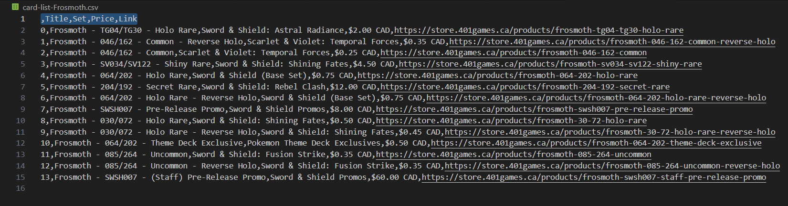
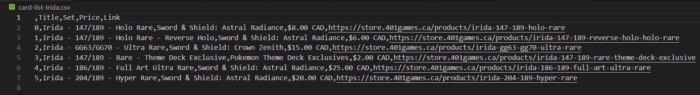

# TCG-Netdeck-Project

### My Story:
One night, I was trying to buy the individual cards for a MTG commander deck of 100 different cards. It was very time consuming trying to get all the cards for the cheapest price possible from the stores closest to me as building a MTG deck can get very expensive. I also wanted to get into Pokemon trading card game too, so I decided to make a project that will help reduce the time to build a deck while minimizing the price I could get these cards.

### Goal for the project:
Be able to take an input decklist for Pokemon, MTG, or Yugioh, input it into this program, and get an optimized price for the entire deck that you can then buy!

### What has been finished:
- Searching for Pokémon cards and scraping data of single card products into csv files on 401-games website is successful. CSV files will have data of title, set, price, and product link for each Pokémon card. 
- The goal for the simplest version of this project: Single process program that adds cheapest, in stock, cards to cart in 401games website only (without application UI).

Card data for Charizard ex in csv file:

Card data for Frosmoth in csv file:

Card data for Irida in csv file:

Card data for Teal Mask Ogerpon ex in csv file:

### Next tasks to complete:
- **Calculate cheapest combination of wanted cards.**
- **Add cards to checkout to make buying decks easier (must login before hand).**
- Calculate cheapest price of deck from Canadian stores that offer letter mail shipping! Letter mail shipping is cheap!
- Have a list of the websites for the cards to be able to scrape card data from shopping options.
- Wiki to look for Pokémon reprints: https://bulbapedia.bulbagarden.net/wiki/Fezandipiti_(TCG)
	- How to use this wiki to be able to tell which cards are reprints of the specific card you want.
	- How to read csv files effectively? Reading card set abbreviations from a csv file of Pokémon sets.
- For faster data scraping, work on multi-process (or threaded) version of the program with selenium. 
- Implement an application UI for the project: [https://ui.shadcn.com/](https://ui.shadcn.com/ "https://ui.shadcn.com/")

### Design decisions to think about for continuing this project:
- Data storage scalability. A full deck list may require a search for 100+ cards. Having 100+ csv files created does not seem to be the wisest decision when the data can be stored in data structures.
- Be an organized project that can be built upon in the future.

### Python script descriptions:

TCG_NetDeck_Proj.py
- main file to run
- Will scrape card data differently depending on whether you're looking for a MTG deck or Pokemon deck. 

scrape-single-page-frosmoth.py
- Will scrape the product data of Card title, card set, card price, and purchase link for the following cards: Teal Mask Ogerpon ex, Charizard ex, Irida, Frosmoth. 
- Puts the product data into 4 different csv files. 

pkmn_abbrv.py
- This script will scrape and output pokemon set abbrievations into a csv file. 
- Scraping from this website: https://pkmncards.com/sets/

news-headlines.py
- Script used to learn how to web scrape with selenium. 
- Learnt from this video: https://www.youtube.com/watch?v=PXMJ6FS7llk&t=4331s

card.py
- Class to encapsulate webscraping functions for single cards.
- Contains data related to the card from webscraping
- In function scrape_single_page, it loads the 401games website that searches for the card, and sorts the product list using filters, then it starts scraping the html and shadow dom data. This is then stored to a csv file and outputted to the terminal.

bulbapedia_scraper.py
- Test script to see if navigation of this website is possible.
- Will be used to figure out which cards are reprints of each other.

### Things I had to learn
Classes OOP
HTML Tags
Selenium
XPath
Shadow DOM

Unit test: periodic testing of each feature implemented to ensure data scraping of card products results no errors. 